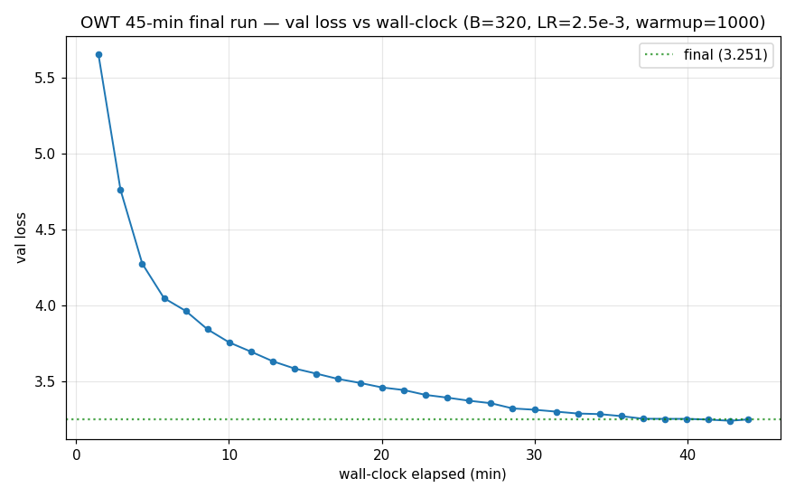
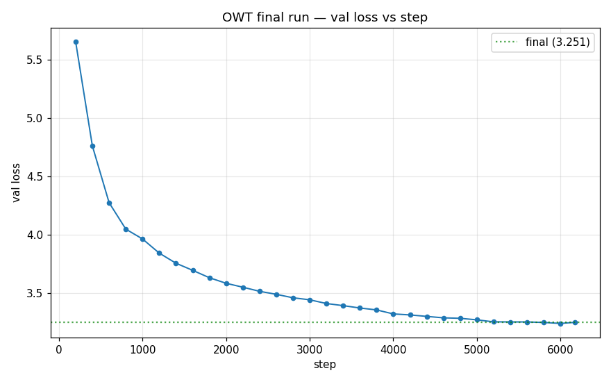
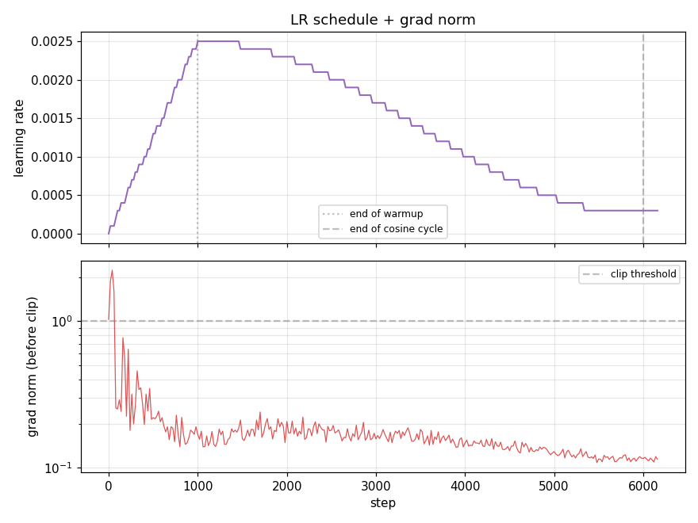

# OWT 45-min Final Training Run

**Run date:** 2026-04-21
**Checkpoint:** `checkpoints/owt_final/iter_0006169_final.pt` (768 MB — not in repo)

## Headline numbers

| metric | value |
|---|---|
| **Final val loss** | **3.2508** |
| **Final val perplexity** | **25.81** |
| Total iters | 6169 |
| Wall-clock | 43.95 min (2636.7 s) |
| Avg throughput (post-compile) | 765,437 tokens/sec (2.34 steps/sec) |
| Total tokens seen | 2.02 B |

## Config

- **Model:** 124 M params — d_model=768, L=12, H=12, d_ff=2048, ctx=1024, vocab=32000, RoPE θ=10000, SwiGLU, RMSNorm, pre-norm.
- **Batch / ctx:** B=320, ctx=1024 → 327 680 tokens/step.
- **Optimizer:** AdamW, β=(0.9, 0.95), wd=0.1, eps=1e-8, grad_clip=1.0.
- **LR schedule:** cosine with `lr_max=2.5e-3`, `lr_min=2.5e-4`, `warmup_iters=1000`, `cosine_cycle_iters=6000`.
- **Precision:** bf16 + `torch.compile` + `F.scaled_dot_product_attention(is_causal=True)`.
- **Env:** `PYTORCH_CUDA_ALLOC_CONF=expandable_segments:True` (required to fit B=320).
- **Hardware:** single B200 (183 GiB VRAM; peak usage ~181 GiB at B=320).

## Val loss vs wall-clock

The run tracks a clean monotonic descent from 10.4 → 5.65 (step 200) → 3.71 (step 1600) →
3.25 (final). The curve is classic log-linear for a well-tuned cosine schedule:
~1 val-loss-unit per log₂ of tokens.

## Val loss vs step

## LR schedule and grad norm

Grad norm was well-behaved throughout — peaked at ~2.2 during early warmup (clipped), dropped to
~0.2 by step 200 and stayed there for the rest of training. Clip fraction fell below 5% after
step 2000. No stability issues.

## Val trajectory (every 400 iters)

| step | val loss | perplexity |
|------|----------|------------|
| 400 | 4.7625 | 117.04 |
| 800 | 4.0500 | 57.40 |
| 1200 | 3.8445 | 46.74 |
| 1600 | 3.6969 | 40.32 |
| 2000 | 3.5859 | 36.09 |
| 2400 | 3.5172 | 33.69 |
| 2800 | 3.4617 | 31.87 |
| 3200 | 3.4125 | 30.34 |
| 3600 | 3.3742 | 29.20 |
| 4000 | 3.3234 | 27.75 |
| 4400 | 3.3023 | 27.18 |
| 4800 | 3.2859 | 26.73 |
| 5200 | 3.2555 | 25.93 |
| 5600 | 3.2547 | 25.91 |
| 6000 | 3.2422 | 25.59 |
| 6169 | 3.2508 | 25.81 |

## Post-mortem

**Worked:**
- A prior short LR sweep landed `LR=2.5e-3`; the final run reused it with no surprises.
- Longer warmup (1000 vs the sweep's 200) kept grad norms calm under the longer cosine.
- Cosine-cycle budget (6000) tracked actual iters (6169) almost perfectly — LR reached
  `lr_min` right as wall-clock cap hit.
- `expandable_segments:True` allowed B=320 where it wouldn't have fit otherwise.

**Didn't work:**
- B=384 OOM'd — short by 8 GiB, even with expandable_segments. Had to smoke-down to B=320.
- Sub-3.0 val loss not reached; landed at 3.25. Deceleration in last 1500 iters was
  steeper than the optimistic extrapolation.

**What would've landed sub-3.0:**
- **Chunked cross-entropy** → unlocks B=512+ → roughly 2× tokens/sec → ~2× more tokens seen in
  same wall-clock = ~0.2-0.3 more val-loss reduction. Biggest single lever still on the table.
- **Tied embeddings** → ~25 M params freed + small val-loss gain. Modest but additive with chunked CE.
- **Muon on matrix params** → claimed 1.5-2× steps-to-loss. Untested.
- **WSD schedule** — spend more time at peak LR by shortening the decay phase. ~0.02-0.05 val.

## Comparison to the prior short run

| run | batch | warmup | iters | wall | final val |
|-----|-------|--------|-------|------|-----------|
| Short LR-sweep winner (8 min) | 256 | 200 | ~1358 | 8 min | 3.71 |
| **Final (45 min)** | **320** | **1000** | **6169** | **43.9 min** | **3.2508** |

Val-loss reduction of 0.46 (from 3.71 → 3.25) bought by 5.6× more wall-clock and 1.5×
more tokens per step. A textbook Chinchilla decay curve.
